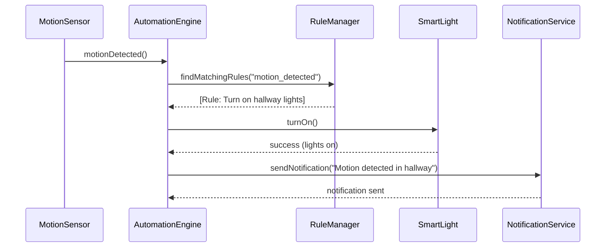

# Smart Home Simulator — Final Project

# 1. Project Overview

## Objective

Design and implement a **Smart Home Simulator** using Object-Oriented Programming principles and software engineering concepts covered in class.

The simulator represents a modern smart home where multiple devices, rooms, users, and automation systems interact together.

The goal of this project is to build a modular, extensible, event-driven system that demonstrates:

- Object-Oriented Design
- SOLID principles
- UML modeling
- Design Patterns
- State management
- Event handling
- Persistence
- Testing
- Layered architecture

---

# 2. Scenario

A company wants to develop a prototype for a smart home platform capable of managing:

- Smart devices
- Rooms
- Sensors
- Users
- Automation rules
- Notifications
- Energy monitoring

The system should simulate how a real smart home behaves.

## Example Scenario

- Motion detected in hallway
- Lights automatically turn on
- Thermostat adjusts temperature
- Security camera starts recording
- Notification sent to owner


# 3. Core System Requirements


# 3.1 House Structure

The system must support:

## House

Contains:
- Rooms
- Devices
- Users
- Automation rules


## Rooms

Examples:
- Kitchen
- Bedroom
- Living Room
- Garage
- Bathroom

Each room can contain multiple smart devices.


# 3.2 Smart Devices

Students must implement a device hierarchy.

## Base Abstract Class

```java
abstract class SmartDevice
```

## Common Properties

- id
- name
- power_state
- room
- energy_consumption

## Common Behaviors

- turn_on()
- turn_off()
- get_status()


# 3.3 Device Types

Students must implement at least 5 device types.

## Required Devices

### Smart Light

Features:
- Brightness control
- Color mode
- Auto shutoff


### Smart Thermostat

Features:
- Target temperature
- Current temperature
- Eco mode

---

### Smart Door Lock

Features:
- Lock/unlock
- Access history
- Security alerts


### Security Camera

Features:
- Motion detection
- Recording state
- Alert generation


### Smart Speaker

Features:
- Volume control
- Music playback
- Voice commands


# 3.4 Sensors

Students must implement sensors that generate events.

## Required Sensors

### Motion Sensor

Triggers:
- Movement detected
- Room occupancy


### Temperature Sensor

Triggers:
- Temperature changes

---

### Smoke Sensor

Triggers:
- Fire alerts


### Door Sensor

Triggers:
- Door opened/closed


# 3.5 Automation System

This is the MOST IMPORTANT part of the project.

Students must implement an automation engine where rules can trigger actions automatically.

## Example Rules

### Rule 1

IF:
- motion detected in hallway

THEN:
- turn on hallway lights


### Rule 2

IF:
- smoke detected

THEN:
- unlock doors
- trigger alarm
- notify users


### Rule 3

IF:
- no motion for 15 minutes

THEN:
- turn off lights


## Automation Requirements

The system must support:

- Multiple triggers
- Multiple actions
- Rule activation/deactivation
- Event-based processing


# 3.6 User System

The system must support users with different roles.

## Roles

### Owner

Can:
- Manage all devices
- Configure automation
- View logs


### Guest

Can:
- Use assigned devices only


### Technician

Can:
- Run diagnostics
- View device health


# 3.7 Notifications System

The system must generate notifications for important events.

## Examples

- Smoke detected
- Door unlocked
- Motion detected at night
- Device offline


# 3.8 Energy Monitoring

The system must track:

- Device energy usage
- Total house consumption
- Most active devices

## Optional

- Daily reports
- Eco recommendations


# 3.9 Persistence

The system must save/load:

- Devices
- Rooms
- Users
- Rules
- Logs

## Possible Formats

- JSON
- SQLite


# 4. Required OOP Concepts

Students MUST demonstrate all concepts below.

| Concept | Example Usage |
|---|---|
| Encapsulation | Private device state |
| Inheritance | SmartDevice subclasses |
| Abstraction | Abstract base classes |
| Polymorphism | Device collections |
| Composition | Rooms contain devices |
| Interfaces | Controllable, Sensor |
| Dependency Injection | Services/repositories |
| Aggregation | House contains rooms |

---

# 5. Required Design Patterns

Students must implement at least 4 patterns.

## REQUIRED Patterns

### 1. Factory Pattern

Used for:
- Device creation

Example:

```java
DeviceFactory.createDevice("LIGHT")
```

---

### 2. Observer Pattern

Used for:
- Sensor event notifications

Example:
- Motion sensor notifies automation system

---

### 3. Strategy Pattern

Used for:
- Automation behaviors
OR
- Energy-saving algorithms

---

### 4. Singleton Pattern

Used for:
- SmartHomeController
OR
- Logger

---

## Optional Patterns

- Command
- State
- Decorator
- Builder
- Repository

---

# 6. Suggested Architecture

```text
Presentation Layer
    ↓
Controllers
    ↓
Services / Automation Engine
    ↓
Domain Objects
    ↓
Repositories / Persistence
```

---

# 7. Required Features Checklist

| Feature | Done |
|---|---|
| Device hierarchy |  |
| Sensor hierarchy |  |
| Automation rules |  |
| Event system |  |
| Persistence |  |
| User roles |  |
| Notifications |  |
| Energy tracking |  |
| Exception handling |  |
| Unit testing |  |
| UML diagrams |  |

---

# 8. UML Requirements

Students must provide:

## A. Full Class Diagram

Including:
- inheritance
- interfaces
- associations
- multiplicity

---

## B. One Sequence Diagram

Students may choose ONE flow.

## Possible Flows

- Motion detection automation
- User unlocking smart door
- Smoke alert handling
- Thermostat auto-adjustment

---

# 9. Example Sequence Diagram Scenario

## Motion Detection Flow



---

# 10. Testing Requirements

Students must include:

## Minimum Unit Tests

- Device state changes
- Rule triggering
- Sensor event handling
- Persistence loading/saving
- User permissions

Minimum:
- 8 meaningful tests

---

# 11. Documentation Requirements

Students must include README file including:

## Required Sections

### 1. Project Overview

Describe the system.

---

### 2. Architecture

Explain layers and structure.

---

### 3. Design Patterns

Explain where and why patterns were used.

---

### 4. SOLID Principles

Provide examples from your code.

---

### 5. UML Diagrams

Insert diagrams (use Mermaid)

---

### 6. Testing

Explain test coverage.

---

### 7. Challenges & Improvements

Discuss lessons learned.

---

# 12. Submission Requirements

Students must submit:

- Git repository link
- Git repo content:
    - Source code
    - README file with:
        - Project documentation (see Section 11)
        - Run instructions
    - Test files


---

# 13. Grading Breakdown

| Category | Weight |
|---|---|
| OOP Design & Architecture | 20% |
| SOLID Principles | 10% |
| Design Patterns | 15% |
| Automation Engine | 20% |
| Code Quality | 10% |
| Persistence | 5% |
| Testing | 5% |
| UML Diagrams | 5% |
| Documentation | 5% |
| Demo & Presentation | 5% |

---

# 14. Bonus Features (+10%)

Possible bonuses:

- Web UI
- Web dashboard
- AI energy optimization
---

# 15. Important Notes

Projects should emphasize:
- clean architecture,
- maintainability,
- extensibility,
- and object-oriented thinking.


---

# 16. Academic Integrity

- Students may discuss ideas together.
- All code must be original.
- External libraries must be documented.
- AI tools may assist learning, but students must fully understand and explain their implementation.